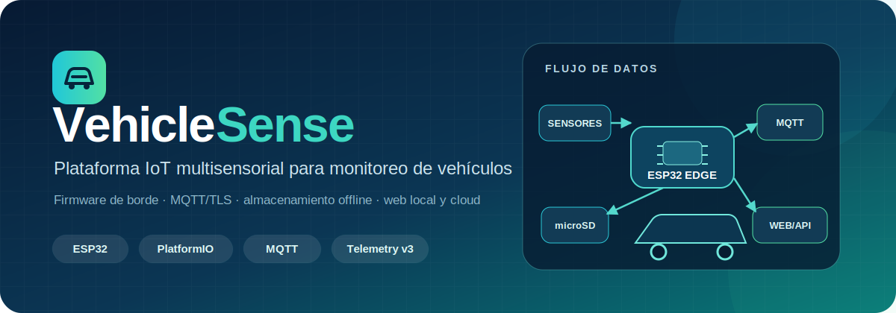
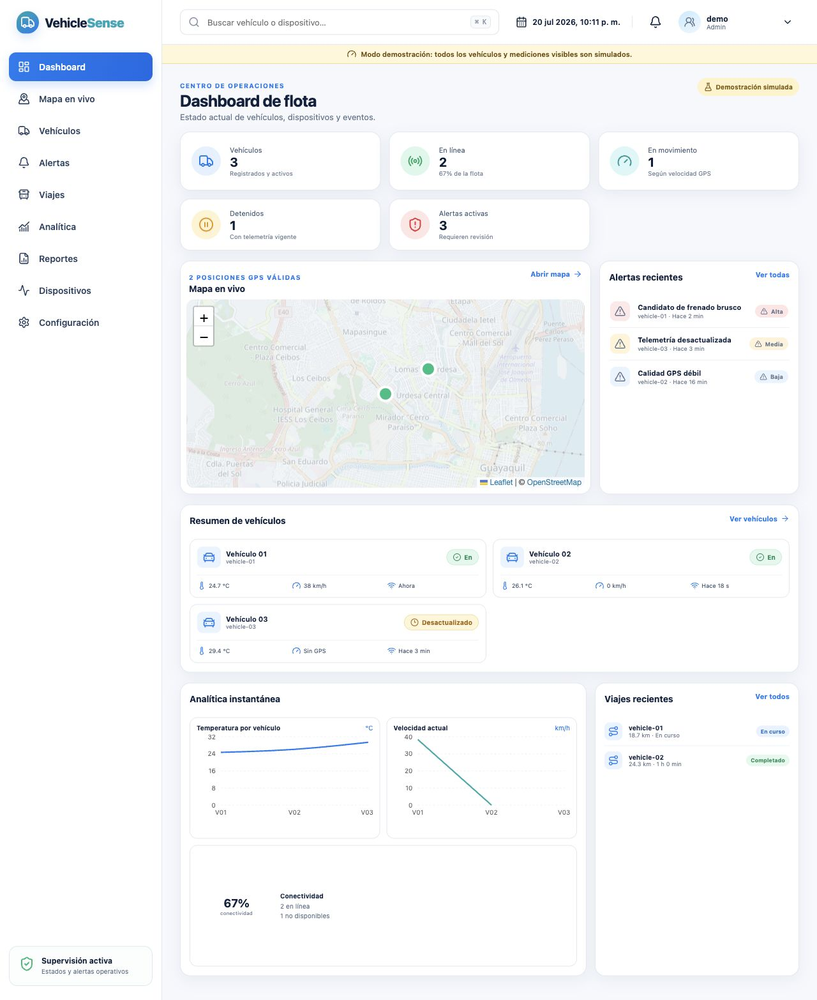
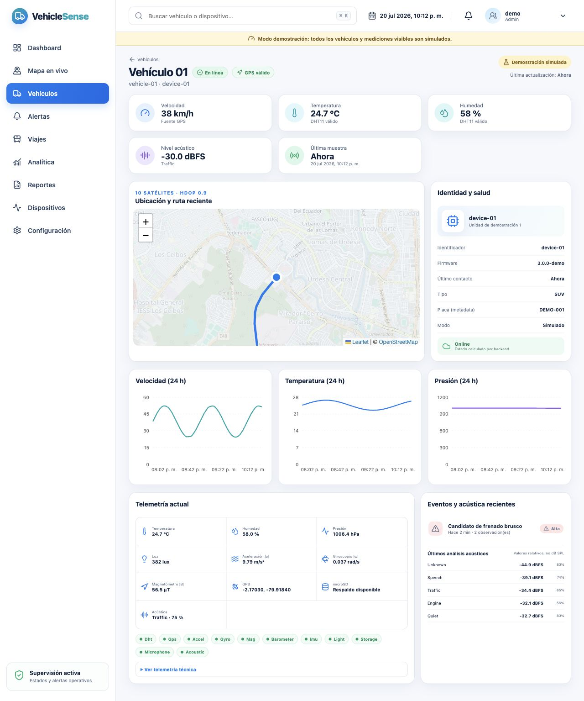
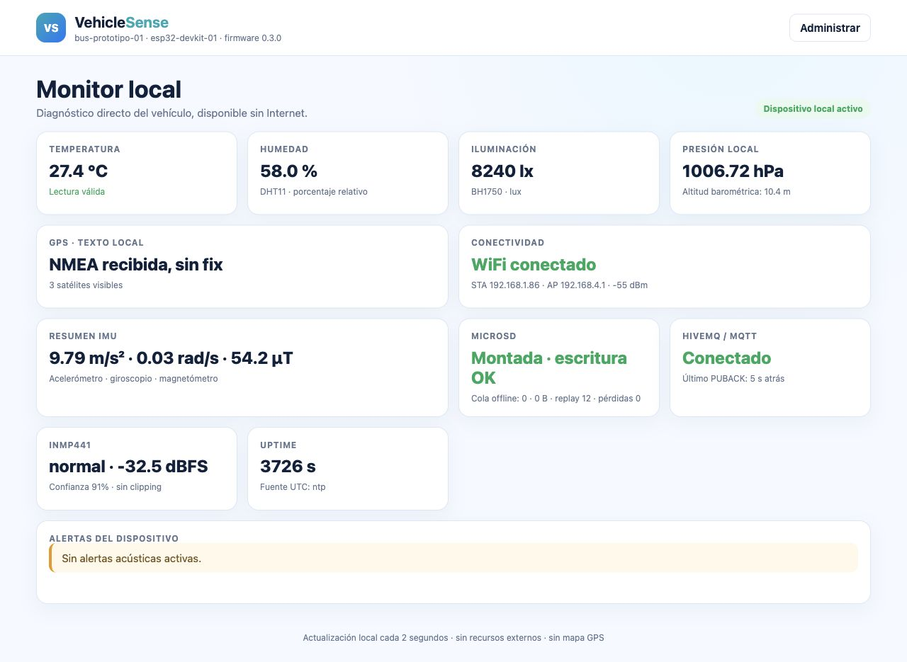
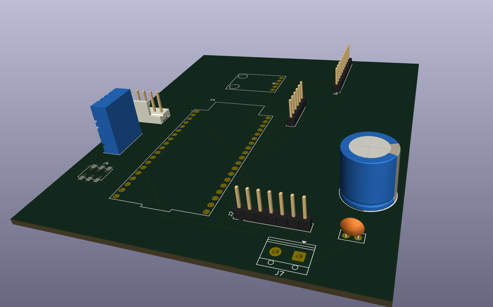
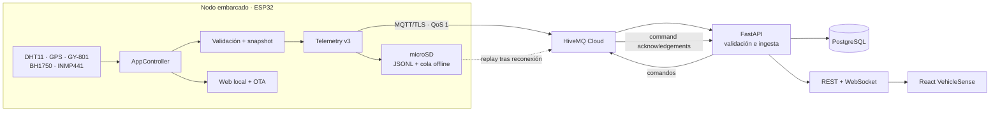

<p align="center">
  
</p>

<p align="center">
  
  
  
  
  
</p>

<p align="center">
  
  
  
  
</p>

<p align="center">
  <strong>Adquisición multisensorial, validación en el borde, respaldo offline y supervisión web de vehículos.</strong>
  <br>
  Firmware modular para ESP32 y una plataforma cloud completa, unidos por contratos MQTT versionados.
</p>

<p align="center">
  <a href="#visión-general">Visión general</a> ·
  <a href="#arquitectura">Arquitectura</a> ·
  <a href="#hardware-y-conexiones">Hardware</a> ·
  <a href="#inicio-rápido">Inicio rápido</a> ·
  <a href="#pruebas-y-environments">Pruebas</a> ·
  <a href="#documentación">Documentación</a>
</p>

> [!IMPORTANT]
> VehicleSense es un prototipo académico de instrumentación. La ruta integrada recomendada usa **WiFi + MQTT/TLS**. El SIM800L permanece como transporte experimental y no se utiliza como sustituto de sistemas vehiculares certificados.

## Visión general

VehicleSense convierte mediciones heterogéneas en telemetría útil y trazable. El nodo embarcado combina temperatura, humedad, iluminación, movimiento, presión, GPS y características acústicas; valida cada fuente, guarda una copia local y publica mensajes MQTT hacia una plataforma de supervisión.

<table>
  <tr>
    <td width="25%"><strong>Edge confiable</strong><br><sub>Lecturas tipadas, banderas de validez y ejecución no bloqueante.</sub></td>
    <td width="25%"><strong>Continuidad offline</strong><br><sub>JSONL y cola microSD acotada hasta recibir PUBACK.</sub></td>
    <td width="25%"><strong>Transporte seguro</strong><br><sub>MQTT 3.1.1 sobre TLS, QoS 1, LWT e identidad por dispositivo.</sub></td>
    <td width="25%"><strong>Supervisión completa</strong><br><sub>Dashboard local, OTA, backend histórico y aplicación web responsive.</sub></td>
  </tr>
</table>

### Principios del proyecto

- **No inventar datos:** una lectura inválida se omite; nunca se reemplaza por cero, `NaN` o una fecha falsa.
- **Tolerar fallos parciales:** un sensor, la microSD o la red pueden fallar sin detener el ciclo principal.
- **Separar responsabilidades:** sensores, telemetría, almacenamiento, comunicación y presentación viven en módulos independientes.
- **Mantener trazabilidad:** cada mensaje conserva identidad, versión de contrato, secuencia, origen real/simulado y condición de replay.
- **Proteger secretos:** credenciales WiFi, MQTT, AP y administración quedan fuera del control de versiones.

## Interfaz y prototipo

<table>
  <tr>
    <td width="50%" align="center">
      <br>
      <sub><strong>Dashboard cloud:</strong> flota, mapa, alertas, viajes y analítica.</sub>
    </td>
    <td width="50%" align="center">
      <br>
      <sub><strong>Detalle del vehículo:</strong> ruta, telemetría, conectividad e histórico.</sub>
    </td>
  </tr>
  <tr>
    <td width="50%" align="center">
      <br>
      <sub><strong>Monitor local:</strong> diagnóstico básico aun cuando no existe Internet.</sub>
    </td>
    <td width="50%" align="center">
      <br>
      <sub><strong>Prototipo físico:</strong> PCB para organizar alimentación y conexiones.</sub>
    </td>
  </tr>
</table>

> [!NOTE]
> Las capturas cloud muestran el frontend en **modo demostración** y contienen datos sintéticos identificados como tales. La interfaz local representa el dashboard embebido en el firmware.

## Arquitectura



La arquitectura separa el dispositivo, el transporte y la aplicación. El navegador nunca recibe credenciales MQTT ni se conecta directamente al broker; consume datos confiables a través del backend.

### Componentes del repositorio

| Ruta | Responsabilidad | Tecnología principal |
|---|---|---|
| [`src/`](src/) y [`include/`](include/) | Firmware, sensores, almacenamiento, web local y comunicaciones | C++ · Arduino · ESP32 |
| [`contracts/`](contracts/) | Tópicos, fixtures y JSON Schema compartidos | JSON Schema 2020-12 |
| [`backend/`](backend/) | Ingesta MQTT, API, WebSocket, alertas, viajes y roles | FastAPI · SQLAlchemy |
| [`frontend/`](frontend/) | Dashboard, mapas, gráficas, alertas e históricos | React · TypeScript |
| [`simulator/`](simulator/) | Publicador multivehículo sin hardware | Python |
| [`deploy/`](deploy/) | Despliegue reproducible, HTTPS, backup y restauración | Docker Compose · Nginx |
| [`docs/`](docs/) | Cableado, seguridad, pruebas y operación | Markdown |

## Hardware y conexiones

| Módulo | Interfaz | Pines ESP32 | Función |
|---|---|---|---|
| DHT11 | Digital | DATA `GPIO27` | Temperatura y humedad |
| GPS NEO-6M | UART2 | RX `GPIO32`, TX `GPIO33` | Posición, velocidad, altitud y hora |
| GY-801 | I2C | SDA `GPIO21`, SCL `GPIO22` | Aceleración, giro, campo magnético y presión |
| BH1750 | I2C | SDA `GPIO21`, SCL `GPIO22` | Iluminación en lux |
| microSD | SPI | SCK `18`, MISO `19`, MOSI `23`, CS `5` | Auditoría JSONL y cola offline |
| INMP441 | I2S | BCLK `26`, WS `25`, DATA `34` | Características acústicas relativas |
| SIM800L | UART1 | RX `16`, TX `17` | Ruta GPRS experimental |

El GY-801 se trata como un módulo compuesto: ADXL345, L3G4200D, HMC5883L y BMP180 conservan validez independiente. El cableado completo, niveles eléctricos y direcciones I2C están en [`docs/wiring.md`](docs/wiring.md).

> [!WARNING]
> El SIM800L requiere una fuente independiente capaz de soportar picos de corriente elevados. No debe alimentarse desde el pin `3V3` del ESP32. El CS de la microSD usa `GPIO5`, por lo que debe permanecer alto durante el arranque.

## Inicio rápido

### Requisitos

- [PlatformIO Core](https://docs.platformio.org/en/latest/core/installation/index.html) o la extensión de PlatformIO para VS Code.
- ESP32 DevKit V1 conectado por USB.
- Git y un monitor serie a `115200` baud.
- Python con [`uv`](https://docs.astral.sh/uv/) y Node.js para los componentes cloud.

### 1. Clonar y configurar el firmware

```bash
git clone https://github.com/PatricioV1207/Multisensory-Device.git
cd Multisensory-Device
cp include/secrets_example.h include/secrets.h
```

Complete `include/secrets.h` con identidades y credenciales propias. Este archivo está ignorado por Git.

### 2. Verificar primero el bus I2C

```bash
pio run -e test_i2c_scanner -t upload
pio device monitor -b 115200
```

Antes de integrar el GY-801 y el BH1750, confirme las direcciones detectadas y los identificadores de cada chip.

### 3. Cargar el perfil integrado recomendado

```bash
pio run -e vehiclesense_wifi -t upload
pio device monitor -b 115200
```

Este perfil habilita sensores, AP+STA, monitor local, OTA, microSD, MQTT/TLS y telemetría v3. Conéctese al SSID definido en `LOCAL_AP_SSID` y abra en el navegador la dirección IP anunciada por el monitor serie.

<details>
<summary><strong>Levantar backend y frontend localmente</strong></summary>

Backend:

```bash
cd backend
cp .env.example .env
uv sync --extra dev
uv run alembic upgrade head
uv run uvicorn app.main:app --reload
```

Frontend, en otra terminal:

```bash
cd frontend
cp .env.example .env
npm ci
npm run dev
```

El frontend utiliza REST para estado e histórico, y WebSocket para actualizaciones en vivo.

</details>

<details>
<summary><strong>Explorar la interfaz sin hardware</strong></summary>

La aplicación incluye una demostración visual explícita:

```bash
cd frontend
cp .env.example .env
VITE_DEMO_MODE=true npm run dev
```

Para probar además MQTT y el backend, use el simulador marcado con `simulated=true`:

```bash
cd simulator
cp .env.example .env
uv sync --extra dev
uv run vehiclesense-simulator --dry-run --cycles 5 --vehicles 3 --scenario mixed
```

</details>

## Pruebas y environments

Cada environment inicializa únicamente los módulos necesarios. Así se puede verificar cableado, lectura y recuperación antes de conectar todo el sistema.

| Perfil | Propósito |
|---|---|
| `vehiclesense_wifi` | Integración recomendada con WiFi, TLS, microSD, web local y telemetría v3 |
| `full_prototype` | Perfil base compatible con la arquitectura inicial |
| `full_prototype_cellular` | Integración experimental mediante SIM800L/GPRS |
| `calibrate_bmp180` | Calibración barométrica por altitud conocida o GPS |
| `collect_acoustic_features` | Recolección etiquetada de características sin guardar audio crudo |

<details>
<summary><strong>Ver todos los environments de diagnóstico</strong></summary>

**Sensores y buses**

`test_dht11`, `test_gps`, `test_i2c_scanner`, `test_adxl345`, `test_l3g4200d`, `test_hmc5883l`, `test_bmp180`, `test_gy801`, `test_bh1750`, `test_inmp441`.

**Almacenamiento, red y web local**

`test_microsd`, `test_wifi`, `test_mqtt_wifi`, `test_local_web`, `test_local_ota`.

**Celular experimental**

`test_sim800l_at`, `test_sim800l_gprs`, `test_sim800l_mqtt`, `test_sim800l_mqtt_tls`.

**Pruebas nativas Unity**

`test_payload_json`, `test_barometer_math`, `test_local_web_json`, `test_mqtt_topics`, `test_offline_queue`, `test_acoustic_classifier`.

</details>

Ejecute un diagnóstico físico con:

```bash
pio run -e test_bh1750 -t upload
pio device monitor -b 115200
```

Ejecute una prueba nativa sin ESP32 con:

```bash
pio test -e test_payload_json
```

La secuencia completa, los estímulos y los criterios PASS/FAIL se encuentran en [`docs/tests.md`](docs/tests.md).

## Telemetría y MQTT

El prefijo del protocolo es `vehiclesense/v1`. Cada rama queda limitada por `vehicle_id` y `device_id`:

```text
vehiclesense/v1/vehicles/{vehicle_id}/devices/{device_id}/telemetry
vehiclesense/v1/vehicles/{vehicle_id}/devices/{device_id}/status
vehiclesense/v1/vehicles/{vehicle_id}/devices/{device_id}/events
vehiclesense/v1/vehicles/{vehicle_id}/devices/{device_id}/acoustic
vehiclesense/v1/vehicles/{vehicle_id}/devices/{device_id}/commands
vehiclesense/v1/vehicles/{vehicle_id}/devices/{device_id}/command-acks
```

Ejemplo abreviado de telemetría v3:

```json
{
  "schema_version": 3,
  "message_type": "telemetry",
  "device_id": "vehiclesense_device_01",
  "vehicle_id": "vehicle_01",
  "sample_id": "vehiclesense_device_01:7:42",
  "time_valid": true,
  "measured_at": "2026-07-20T23:18:51Z",
  "temperature_c": 24.7,
  "humidity_percent": 45.0,
  "gps_valid": true,
  "latitude": -2.189412,
  "longitude": -79.889066,
  "accel_valid": true,
  "accel_z": 9.79,
  "baro_valid": true,
  "pressure_hpa": 1006.65,
  "bh1750_valid": true,
  "light_lux": 320.0,
  "sd_valid": true,
  "mqtt_connected": true,
  "simulated": false,
  "replayed": false
}
```

Las banderas de validez siempre se publican. Los números no finitos, obsoletos o pertenecientes a un sensor inválido se omiten. Consulte [`contracts/`](contracts/README.md) para los schemas y [`contracts/mqtt-topics.md`](contracts/mqtt-topics.md) para QoS, retain y ACL.

## Almacenamiento y recuperación

1. Cada snapshot válido se escribe como una línea JSON en la microSD.
2. Las muestras no confirmadas se agregan a una cola offline acotada.
3. Al recuperar la conexión, el firmware reproduce la cola en orden.
4. Un registro se elimina únicamente después de recibir el PUBACK correspondiente.
5. Los mensajes reproducidos conservan `sample_id` y se marcan con `replayed=true`.

La política de rotación, límites y tolerancia a pérdida de energía se documenta en [`docs/storage.md`](docs/storage.md).

## Calidad del proyecto

Pruebas nativas del firmware:

```bash
pio test -e test_payload_json
pio test -e test_barometer_math
pio test -e test_local_web_json
pio test -e test_mqtt_topics
pio test -e test_offline_queue
pio test -e test_acoustic_classifier
```

Validación de los componentes cloud:

```bash
(cd backend && uv run ruff check . && uv run pytest -q)
(cd frontend && npm run lint && npm test -- --run && npm run build)
(cd simulator && uv run ruff check . && uv run pytest -q)
python3 contracts/validate_fixtures.py
```

## Documentación

| Documento | Contenido |
|---|---|
| [Arquitectura del firmware](docs/architecture.md) | Capas, flujo, temporización y extensiones |
| [Cableado](docs/wiring.md) | Pinout, niveles eléctricos y mapa I2C |
| [Payload de telemetría](docs/telemetry_payload.md) | Campos, unidades, validez y versiones |
| [Pruebas](docs/tests.md) | Procedimientos por environment y criterios de aceptación |
| [HiveMQ Cloud](docs/hivemq_cloud.md) | TLS, credenciales, ACL y diagnóstico |
| [Web local y OTA](docs/local_web_ota.md) | Endpoints, autenticación y actualización |
| [Almacenamiento](docs/storage.md) | JSONL, cola offline, rotación y replay |
| [Monitoreo acústico](docs/acoustic_monitoring.md) | I2S, dBFS, características y límites |
| [Arquitectura cloud](docs/cloud_architecture.md) | Backend, base de datos, frontend y despliegue |
| [Seguridad](docs/security.md) | Modelo de confianza y riesgos pendientes |

## Estado actual

| Área | Estado | Observación |
|---|---|---|
| Firmware modular ESP32 | ✅ Implementado | Sensores, validación, web local, OTA y microSD |
| Ruta WiFi + MQTT/TLS | ✅ Implementada | Requiere credenciales y ACL propias para la prueba externa |
| Contratos y backend | ✅ Implementados | La aceptación final necesita PostgreSQL y broker aprovisionados |
| Frontend responsive | ✅ Implementado | Incluye modo demo explícito y datos sintéticos identificados |
| SIM800L/GPRS | 🧪 Experimental | Cobertura 2G, alimentación y TLS dependen del entorno y firmware |
| Monitoreo acústico | 🧪 Experimental | Valores relativos dBFS; todavía no equivalen a dB SPL calibrados |
| Despliegue productivo | 📋 Documentado | Requiere VM, dominio, DNS, certificados y prueba integral |

### Próximos pasos

- [ ] Completar una prueba física prolongada ESP32 → HiveMQ → backend → frontend.
- [ ] Recopilar y validar un dataset acústico real balanceado.
- [ ] Evaluar un módem LTE con soporte TLS más sólido.
- [ ] Firmar criptográficamente las actualizaciones OTA y añadir rollback verificado.
- [ ] Validar la solución dentro del gabinete final y bajo condiciones reales de vehículo.

## Seguridad y uso responsable

- Nunca suba `include/secrets.h`, archivos `.env`, tokens MQTT o contraseñas reales.
- Use credenciales separadas para dispositivo, backend y administración.
- Limite cada dispositivo mediante ACL a sus propios tópicos.
- Mantenga TLS y validación de hostname en cualquier red no controlada.
- No utilice este prototipo para decisiones de seguridad crítica o diagnóstico certificado del vehículo.

Revise el modelo completo en [`docs/security.md`](docs/security.md) antes de exponer el sistema a Internet.

---

<p align="center">
  Desarrollado por <a href="https://github.com/PatricioV1207"><strong>Patricio Vásquez</strong></a><br>
  <sub>VehicleSense · monitoreo vehicular IoT modular y extensible</sub>
</p>
