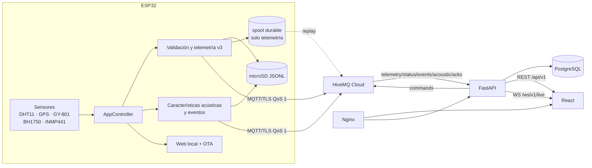

# Arquitectura actual de VehicleSense

Estado al 2026-08-30. Esta es la vista completa del sistema implementado y sus
límites; [`../STATUS.md`](../STATUS.md) mantiene el corte operativo y
[`../ROADMAP.md`](../ROADMAP.md) el trabajo futuro.

## Fuentes de verdad

La prioridad es: **código ejecutable, configuración, migraciones y contratos; luego
pruebas; luego documentación**. En particular:

- `platformio.ini`, `include/config.h` y `src/` definen perfiles y firmware;
- `contracts/schemas/` y `contracts/mqtt-topics.md` definen mensajes/tópicos;
- `backend/app`, `backend/migrations` y OpenAPI definen persistencia y API;
- `frontend/src` y `simulator/vehiclesense_simulator` definen sus clientes;
- `deploy/compose.production.yml`, Nginx y scripts con guion bajo definen despliegue.

Los documentos explican esas interfaces, pero no las modifican.

## Mapa de componentes



| Componente | Responsabilidad real | Límite relevante |
|---|---|---|
| Firmware ESP32 | adquirir, validar, serializar, archivar, publicar y servir diagnóstico local | comandos no se ejecutan; OTA no está firmada |
| HiveMQ Cloud | autenticación, ACL, TLS y transporte MQTT | es externo; no existe broker en Compose |
| Backend FastAPI | frontera confiable de ingesta, persistencia, REST/WS, alertas, viajes y comandos | no hay ACL por vehículo ni sesiones refresh revocables |
| PostgreSQL | estado e historial normalizados | sin cleanup de retención ni evidencia productiva |
| Frontend React | consulta y operación mediante backend | no es frontera de autorización; Settings no configura |
| Simulador | productor contractual reproducible | no demuestra sensores ni ejecución real de comandos |
| Deploy | Nginx, frontend, backend, PostgreSQL y Certbot en una VM | AWS es guía, no infraestructura comprobada; OCI es histórica |

## Flujo de datos del dispositivo

`AppController` orquesta sin acoplar drivers a red o JSON. GPS drena UART con alta
frecuencia; sensores tienen validez independiente; `TelemetryValidator` omite datos
no finitos, fuera de rango u obsoletos. El perfil recomendado es
`vehiclesense_wifi`; `full_prototype` conserva compatibilidad y
`full_prototype_cellular` es experimental. Los demás environments diagnostican una
capacidad o ejecutan pruebas nativas.

Telemetría v3 conserva `vehicle_id`, `device_id`, `boot_id`, `sequence`,
`sample_id`, validez, `simulated` y `replayed`. `measured_at` solo aparece con hora
confiable; el backend añade `received_at`. Los tópicos canónicos son:

```text
vehiclesense/v1/vehicles/{vehicle_id}/devices/{device_id}/telemetry
vehiclesense/v1/vehicles/{vehicle_id}/devices/{device_id}/status
vehiclesense/v1/vehicles/{vehicle_id}/devices/{device_id}/events
vehiclesense/v1/vehicles/{vehicle_id}/devices/{device_id}/acoustic
vehiclesense/v1/vehicles/{vehicle_id}/devices/{device_id}/commands
vehiclesense/v1/vehicles/{vehicle_id}/devices/{device_id}/command-acks
```

El estado `offline` es LWT retenido; `online` se publica retenido. `stale` y
`offline` también pueden derivarse en backend por tiempo sin contacto o mensaje
reciente; `last_seen_at` se actualiza con telemetría, acústica y estado.

## Almacenamiento, entrega y replay

La microSD cumple dos funciones independientes:

1. `MicroSDLogger` archiva telemetría, agregados acústicos y eventos como JSONL.
2. `OfflineTelemetryQueue` conserva **solo telemetría v3** pendiente en `/spool`.

El spool es FIFO, acotado, lleva checksum, sobrevive reinicios y elimina una muestra
solo después de PUBACK. El replay conserva `sample_id` y marca `replayed=true`; el
backend deduplica porque QoS 1 permite duplicados. Acústica y eventos tienen QoS 1 y
archivo local, pero una desconexión no activa replay durable. El simulador tiene una
cola acotada equivalente solo en memoria.

## Ingesta y persistencia cloud

El backend se suscribe a cinco ramas de dispositivo y publica solo `commands`.
Valida tamaño, tópico, coincidencia de identidad, schema y números finitos antes de
persistir. Duplicados se resuelven con IDs estables; rechazos contractuales quedan en
`ingestion_failures`. Un mensaje aceptado o puesto en cuarentena recibe ACK manual;
un fallo interno fuerza reconexión para solicitar reentrega. No existe una cola
interna acotada entre callback MQTT y procesamiento.

Las migraciones crean `users`, `vehicles`, `devices`, `telemetry`,
`acoustic_measurements`, `alerts`, `trips`, `trip_points`,
`device_status_history`, `commands` e `ingestion_failures`. Los viajes se infieren
por GPS y los replay no alimentan esa inferencia en vivo. Las alertas usan lógica y
umbrales del modelo actual; no existe una tabla genérica de reglas configurables.
Tampoco hay limpieza automática de históricos.

## API, tiempo real y control

REST vive bajo `/api/v1`; las rutas principales están inventariadas en
`backend/README.md`. El WebSocket `/ws/v1/live` autentica el access JWT en el primer
frame y entrega notificaciones en vivo. No conserva backlog: tras reconexión, el
cliente refresca REST.

FastAPI verifica roles `admin`, `operator` y `viewer`. La autorización actual es
global: no hay asignación usuario→vehículo. Los refresh JWT se validan de forma
autocontenida; no existe persistencia de sesiones, revocación ni endpoint logout.

El backend publica comandos contractuales y registra sus ACK. El firmware valida
identidad, pero siempre responde `state=unsupported` y
`error_code=COMMAND_HANDLER_DEFERRED`; no hay actuadores ni ejecución semántica. El
simulador también acusa de forma simulada, no ejecuta efectos reales.

## Presentación local y cloud

El ESP32 crea AP WPA2 y sirve `/`, `/api/status`, `/api/telemetry/basic`, `/admin` y
`/admin/update`. `/api/telemetry/basic` incluye GPS textual; `/api/status` omite GPS.
OTA usa HTTP Basic en red local, no HTTPS, firma o rollback automático.

React obtiene estado/historial por REST e invalida consultas por WebSocket. Incluye
flota, mapas, detalle, alertas, viajes, analítica, reportes y modo demo explícito.
Settings es informativo. CSV/JSON se generan en el navegador con las últimas 24 h
consultadas. El backend sigue siendo la única frontera de autorización.

## Despliegue y operación

`deploy/compose.production.yml` ejecuta PostgreSQL, FastAPI, frontend estático, Nginx
y Certbot en una VM Ubuntu ARM64 o AMD64. Solo Nginx publica 80/443; PostgreSQL y
FastAPI quedan en redes Docker. HiveMQ permanece externo por TCP 8883 saliente.

AWS EC2 es el proveedor documental de referencia y OCI una alternativa histórica.
La topología es de una instancia, sin alta disponibilidad. Los scripts canónicos son
`backup_postgres.sh` y `restore_postgres.sh`; backup genera dump/checksum, pero copia
externa, cifrado, retención y pruebas de restore son responsabilidades operativas.
No hay evidencia en el repositorio de una EC2 aprovisionada o de este stack ejecutado
contra PostgreSQL/HiveMQ reales.

## Fronteras de confianza y seguridad

```text
ESP32/simulador --credencial por identidad + TLS--> HiveMQ
backend --------credencial separada + TLS---------> HiveMQ
navegador ------JWT por HTTPS/WSS-----------------> Nginx/FastAPI
FastAPI --------red Docker privada----------------> PostgreSQL
```

ACL MQTT deben limitar cada dispositivo a su identidad; el navegador nunca recibe
credenciales MQTT o PostgreSQL. Argon2, JWT, roles, validación contractual, CSP y
aislamiento Compose reducen riesgo, pero no prueban seguridad completa. Persisten
riesgos de XSS sobre tokens en `sessionStorage`, extracción física de credenciales,
JWT no revocables, OTA sin firma, secretos administrados manualmente, falta de MFA,
retención y observabilidad incompletas y una sola VM.

GPS es dato sensible. No se almacena audio crudo; dBFS no equivale a dB SPL y
`heuristic-1` carece de dataset de validación. VehicleSense no es un sistema de
seguridad vehicular certificado.

## Brechas explícitas

- Sin evidencia física ni E2E externa fechada.
- Sin ejecución de comandos en firmware.
- Sin replay durable para acústica/eventos.
- Sin ACL por vehículo, sesiones revocables/logout ni API de historial de estado.
- Sin reglas de alerta genéricas, cola interna de ingesta acotada o cleanup.
- SIM800L/TLS y clasificador acústico no validados en campo.
- OTA sin firma/rollback; producción AWS no aprovisionada ni observada.
- PCB Rev A en borrador y bloqueada antes de fabricar.
