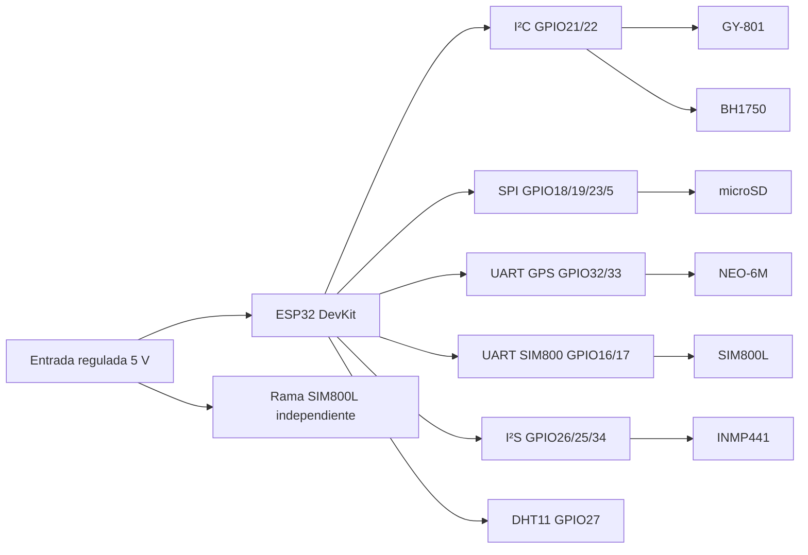

# Especificación de la PCB del nodo embarcado

**Estado:** borrador técnico para diseño y revisión eléctrica
**Fecha:** 2026-08-02
**Proyecto:** `Proyecto_Monitoreo_Automovil`
**Objetivo:** definir todo lo necesario para diseñar, fabricar, ensamblar y validar una PCB portadora de los módulos que utiliza el firmware del nodo embarcado.

> Este documento describe una **PCB portadora de módulos**. El repositorio no contiene todavía un esquemático, una PCB de KiCad, footprints verificados, archivos Gerber ni dibujos mecánicos de los breakouts. Por lo tanto, este documento fija el comportamiento eléctrico y el netlist que el firmware necesita, pero no autoriza fabricar hasta cerrar las verificaciones de la sección [Bloqueos antes de fabricar](#14-bloqueos-antes-de-fabricar).

> **Actualización de revisión (31-08-2026).** La evidencia visual incorporada en `docs/assets/informe_pcb_caja/` documenta la revisión física utilizada en el informe final como una **PCB de cuatro capas**, junto con su fabricación y ensamblaje. Las menciones a una PCB de dos capas que aparecen más adelante son recomendaciones preliminares de este borrador y no describen la revisión física actual; el *stack-up* detallado, el CAD fuente, los Gerber y la verificación eléctrica de cuatro capas todavía deben archivarse para cerrar este documento.

## 1. Resultado de la auditoría

El firmware está construido para un `ESP32 DevKit` compatible con `esp32dev` de PlatformIO y utiliza estos módulos:

| Referencia propuesta | Módulo/componente | Interfaz | Uso en el proyecto | Estado de la integración |
|---|---|---|---|---|
| U1 | ESP32 DevKit V1 / ESP32-WROOM, variante exacta por congelar | USB, WiFi, GPIO | Controlador principal, MQTT/TLS, web local, OTA y procesamiento | Obligatorio |
| J-DHT | DHT11 o breakout DHT11 | GPIO digital | Temperatura y humedad | Obligatorio |
| J-GPS | NEO-6M | UART2 | Latitud, longitud, altitud, velocidad y tiempo UTC | Obligatorio |
| J-GY801 | GY-801 | I²C | ADXL345, L3G4200D, HMC5883L y BMP180 | Obligatorio; cuatro dispositivos independientes |
| J-BH1750 | BH1750 | I²C | Iluminación en lux | Obligatorio para `vehiclesense_wifi` |
| J-SD | Módulo microSD SPI | SPI | Archivo JSONL y cola offline | Obligatorio para almacenamiento local |
| J-SIM | SIM800L V2 o breakout equivalente | UART1 | GPRS/MQTT experimental | Opcional y experimental |
| J-MIC | INMP441 | I²S | Características acústicas relativas | Obligatorio para la función acústica |
| J-PWR | Entrada de alimentación regulada | Alimentación | Alimenta la placa portadora y los módulos | Obligatorio |
| J-ANT-GPS | Antena del GPS o conector del breakout | RF | Recepción GNSS | Según el NEO-6M elegido |
| J-ANT-SIM | Antena del módem | RF | Comunicación GSM/GPRS | Solo si se monta SIM800L |

La imagen `docs/assets/readme/pcb-3d.png` debe tratarse como una referencia visual de concepto. No es una fuente de dimensiones ni de conectividad.

### 1.1 Perfil de firmware recomendado

El perfil de aceptación de la placa integrada es:

```text
vehiclesense_wifi
```

Este perfil es el que inicializa sensores, BH1750, microSD, micrófono, WiFi, MQTT/TLS, web local, OTA y cola offline. Los perfiles `full_prototype` y `full_prototype_cellular` tienen rutas de inicialización diferentes; que un módulo no aparezca en una prueba no significa que deba eliminarse de la PCB.

Perfiles físicos de diagnóstico relevantes:

```text
test_dht11
test_gps
test_i2c_scanner
test_adxl345
test_l3g4200d
test_hmc5883l
test_bmp180
test_gy801
test_bh1750
test_microsd
test_inmp441
test_sim800l_at
test_sim800l_gprs
test_sim800l_mqtt
test_sim800l_mqtt_tls
vehiclesense_wifi
```

### 1.2 Fuentes de verdad del repositorio

Antes de cambiar el netlist, revisar conjuntamente:

- [`include/pins.h`](../include/pins.h): asignación de GPIO.
- [`include/config.h`](../include/config.h): direcciones, frecuencias, intervalos y límites.
- [`platformio.ini`](../platformio.ini): placa, framework, librerías y environments.
- [`docs/wiring.md`](wiring.md): cableado y niveles previstos.
- [`docs/tests.md`](tests.md): secuencia de pruebas físicas.
- [`docs/storage.md`](storage.md): microSD, SPI y spool offline.
- [`docs/cellular_mqtt.md`](cellular_mqtt.md): fuente y restricciones del SIM800L.
- [`docs/acoustic_monitoring.md`](acoustic_monitoring.md): I²S, micrófono y límites acústicos.

## 2. Arquitectura eléctrica de la placa

La recomendación para la primera revisión es una PCB de dos capas que lleve el ESP32 DevKit y los breakouts mediante conectores de paso de 2.54 mm. No se deben integrar inicialmente los encapsulados desnudos ADXL345, L3G4200D, HMC5883L, BMP180 o BH1750: el firmware y la documentación actuales están definidos para módulos, no para un diseño de sensores a nivel de IC. El repositorio no contiene evidencia física que permita considerar ese hardware validado.



### 2.1 Reglas no negociables

1. Todas las señales del ESP32 son de lógica de 3.3 V. Ningún GPIO debe recibir 5 V.
2. La alimentación del SIM800L no puede salir del pin `3V3` del ESP32.
3. La rama del SIM800L debe tener una fuente propia, retorno de tierra de baja impedancia y capacidad para los picos de corriente exigidos por el breakout exacto; el repositorio exige como mínimo una capacidad de pico de 2 A.
4. El `CS` de microSD en GPIO5 debe quedar en alto durante el reset y el arranque.
5. GPIO34 es solo entrada y se reserva para `INMP441 SD`.
6. GPIO6–GPIO11 no se deben conectar: pertenecen a la memoria flash del ESP32.
7. El bus I²C debe tener una sola red efectiva de pull-ups a 3.3 V. Los pull-ups de los breakouts deben verificarse antes de poblar pull-ups en la portadora.
8. No se deben conectar simultáneamente USB y una fuente externa al ESP32 DevKit sin verificar el esquema de alimentación de la variante exacta.
9. Desconectar la alimentación antes de insertar, retirar o modificar módulos.
10. No fabricar una conexión directa a batería de vehículo de 12/24 V: el repositorio no define una protección automotriz ni un regulador de entrada para load-dump, inversión de polaridad o transitorios.

## 3. Mapa completo de pines y nets

Los nombres de net de esta tabla deben utilizarse tal cual en el esquemático. Las etiquetas `TX` y `RX` se expresan desde el punto de vista del ESP32 en la columna correspondiente.

| Net de PCB | GPIO ESP32 | Dirección en ESP32 | Conector/módulo | Pin del módulo | Función | Requisito eléctrico |
|---|---:|---|---|---|---|---|
| `DHT_DATA` | 27 | E/S | J-DHT | DATA | DHT11 | Pull-up opcional de 4.7–10 kΩ a `ESP_3V3`; no usar 5 V |
| `GPS_RX_ESP` | 32 | Entrada | J-GPS | TX del NEO-6M | NMEA hacia ESP32 | UART 9600, nivel compatible con 3.3 V |
| `GPS_TX_ESP` | 33 | Salida | J-GPS | RX del NEO-6M | Configuración opcional | El firmware actual no lo necesita; dejar con resistor/puente opcional |
| `I2C_SDA` | 21 | E/S | J-GY801, J-BH1750 | SDA | Bus I²C compartido | Pull-up a 3.3 V; no elevar a 5 V |
| `I2C_SCL` | 22 | E/S | J-GY801, J-BH1750 | SCL | Bus I²C compartido | Pull-up a 3.3 V; no elevar a 5 V |
| `SD_SCK` | 18 | Salida | J-SD | SCK | Reloj SPI | Frecuencia configurada: 10 MHz |
| `SD_MISO` | 19 | Entrada | J-SD | MISO/DO | Datos SPI hacia ESP32 | Lógica máxima 3.3 V |
| `SD_MOSI` | 23 | Salida | J-SD | MOSI/DI | Datos SPI hacia microSD | Lógica máxima 3.3 V |
| `SD_CS` | 5 | Salida/strap | J-SD | CS | Selección de tarjeta | Pull-up de 10 kΩ a 3.3 V; alto durante boot |
| `SIM_RX_ESP` | 16 | Entrada | J-SIM | TX del SIM800L | UART1 hacia ESP32 | Verificar nivel de salida del breakout |
| `SIM_TX_ESP` | 17 | Salida | J-SIM | RX del SIM800L | UART1 hacia módem | Divisor/level shifter si el breakout no adapta 3.3 V |
| `I2S_BCLK` | 26 | Salida | J-MIC | SCK/BCLK | Reloj I²S | Pista corta; resistor serie opcional |
| `I2S_WS` | 25 | Salida | J-MIC | WS/LRCL | Selección de palabra | Pista corta; resistor serie opcional |
| `I2S_DATA_IN` | 34 | Entrada solamente | J-MIC | SD | Datos I²S | No usar para salida ni pull-up externo |
| `MIC_LR` | — | — | J-MIC | L/R | Selección de canal | Conectar permanentemente a `GND` |
| `ESP_3V3` | 3V3 | Alimentación | U1 | 3V3 | Rail del DevKit | No paralelizar con otro regulador |
| `5V_ESP` | 5V | Alimentación | U1 | 5V/VIN según DevKit | Alimentación del ESP32 | Fuente regulada; selección USB/external excluyente |
| `3V3_SENS` | — | Alimentación | J-DHT/J-GPS/J-GY801/J-BH/J-SD/J-MIC | VCC/VDD | Alimentación de sensores | Rail dedicado recomendado; 3.3 V solamente |
| `SIM_VIN` | — | Alimentación | J-SIM | VCC/5V/VIN según breakout | Alimentación del módem | Rama independiente; tensión definida por la placa SIM800L concreta |
| `GND` | GND | Retorno | Todos | GND | Referencia común | Plano de tierra y retorno de baja impedancia |

Cuando se use un regulador separado para `3V3_SENS`, las resistencias de pull-up y straps que conectan directamente con GPIO (`DHT_DATA`, `I2C_SDA`, `I2C_SCL` y `SD_CS`) deben ir a `ESP_3V3`, denominado aquí también rail de I/O. No se debe dejar `3V3_SENS` encendido con U1 retirado o sin alimentación, porque una señal alta podría retroalimentar el ESP32 a través de un GPIO.

### 3.1 Conexión del ESP32 DevKit

El proyecto declara `board = esp32dev`, pero eso no fija el modelo mecánico del DevKit. Para la PCB se debe seleccionar una única variante: 30 pines, 38 pines, WROOM/WROVER, posición del USB, ancho entre hileras y orden de la serigrafía. El firmware requiere que GPIO16, 17, 18, 19, 21, 22, 23, 25, 26, 27, 32, 33 y 34 estén expuestos.

Recomendación para Rev A:

- usar ESP32-WROOM, no ESP32-WROVER, porque el firmware usa GPIO16 y GPIO17 para SIM800L;
- montar el DevKit en zócalos hembra para poder retirarlo durante las pruebas;
- mantener el USB accesible desde el borde de la PCB;
- colocar el extremo de la antena PCB del ESP32 hacia el borde y conservar la zona libre indicada por el fabricante de la variante elegida;
- incorporar serigrafía con el número GPIO, no solo con nombres `Dxx`;
- no asumir que dos placas comerciales con la etiqueta “ESP32 DevKit V1” tienen el mismo contorno.

La guía oficial de [ESP32-DevKitC](https://documentation.espressif.com/projects/esp-dev-kits/en/latest/esp32/esp32-devkitc/user_guide.html) confirma la exposición de GPIO34, 32, 33, 25, 26, 27, 23, 22, 21, 19, 18, 5, 17 y 16 en la familia WROOM, y advierte que GPIO6–GPIO11 están asociados a la memoria flash.

## 4. Módulos y requisitos específicos

### 4.1 ESP32 DevKit / ESP32-WROOM — U1

**Función:** CPU, WiFi, MQTT/TLS, servidor web local, OTA, almacenamiento de identidad y coordinación de sensores.

**Conexiones:**

- `5V_ESP` o alimentación USB, nunca ambas sin una selección eléctrica segura.
- `GND` al plano común.
- Todos los GPIO de la tabla de nets.
- USB en el propio DevKit para programación y recuperación.

**Diseño de la portadora:**

- zócalos de 2.54 mm en lugar de soldar U1 directamente;
- test points para `5V_ESP`, `ESP_3V3`, `GND`, `EN`, `GPIO5`, `GPIO16`, `GPIO17`, `GPIO21`, `GPIO22`, `GPIO25`, `GPIO26`, `GPIO32`, `GPIO33` y `GPIO34`;
- botón o acceso físico a `EN` y `BOOT` del propio DevKit;
- no colocar cobre, tornillos, cables de potencia ni módulos metálicos frente a la antena del ESP32;
- mantener libres los GPIO de arranque que no formen parte del diseño.

### 4.2 DHT11 — J-DHT

**Interfaz usada:** una línea digital en GPIO27. El firmware lee cada 2000 ms.

**Conector recomendado:** 1×3, rotulado `3V3`, `DHT_DATA`, `GND`. Si se desea conectar un sensor remoto, utilizar un conector bloqueable y ubicarlo lejos de fuentes de calor.

**Componentes de la portadora:**

- `R-DHT` de 4.7 kΩ a 10 kΩ desde `DHT_DATA` a `ESP_3V3`, marcado como `DNP` si el breakout ya trae pull-up;
- `C-DHT` de 100 nF cerca del conector si el módulo no lo incluye;
- no conectar DATA a 5 V;
- mantener el cable DATA corto o usar una resistencia serie pequeña si el cableado exterior es largo.

**Verificación:** con `test_dht11`, comprobar lectura válida, desconexión y recuperación. El firmware omite lecturas no finitas; la PCB no debe sustituirlas por cero.

### 4.3 GPS NEO-6M — J-GPS

**Interfaz usada:** UART2, 9600 baudios, 8N1.

| Señal del módulo | Net de la PCB | GPIO |
|---|---|---:|
| TX | `GPS_RX_ESP` | 32 |
| RX | `GPS_TX_ESP` | 33 |
| VCC | `3V3_SENS` o tensión permitida por el breakout | — |
| GND | `GND` | — |
| PPS | sin conectar en firmware actual | — |

**Diseño RF y mecánico:**

- ubicar el GPS en un borde con la antena mirando al exterior o montar un conector para antena externa;
- separar el GPS del SIM800L, del convertidor buck, de la microSD y de pistas de reloj;
- no colocar cobre, plano metálico o tornillos sobre la zona de antena del breakout;
- dejar un punto de prueba para `GPS_TX` y `GPS_RX`;
- incluir un conector de 4 pines compatible con la placa elegida, no con una huella genérica basada solo en el texto “NEO-6M”.

El NEO-6M es una familia antigua y u-blox lo marca como EOL. Para este prototipo se puede conservar si es el módulo disponible, pero un reemplazo moderno no debe considerarse drop-in: cambia el pinout, el consumo, la antena, la huella y posiblemente la configuración del firmware. Consultar el [datasheet NEO-6 de u-blox](https://content.u-blox.com/sites/default/files/products/documents/NEO-6_DataSheet_%28GPS.G6-HW-09005%29.pdf) para la variante exacta.

**Verificación:** ejecutar `test_gps` al aire libre. Debe haber bytes NMEA, luego un fix fresco; un GPS alimentado sin visibilidad de cielo puede reportar stream sin fix y no implica fallo de la PCB.

### 4.4 GY-801 — J-GY801

El GY-801 es un módulo compuesto, no un sensor único. El firmware valida por separado:

| Componente | Dirección primaria | Alternativa | Identificación esperada |
|---|---:|---:|---|
| ADXL345 | `0x53` | `0x1D` | `DEVID = 0xE5` |
| L3G4200D | `0x69` | `0x68` | `WHO_AM_I = 0xD3` |
| HMC5883L | `0x1E` | — | Identificación ASCII `H43` |
| BMP180/BMP085 | `0x77` | — | Chip ID `0x55` |

**Conector recomendado:** 1×4, rotulado `3V3`, `GND`, `I2C_SDA`, `I2C_SCL`. Si el GY-801 elegido expone `INT1`, `INT2`, `DRDY` o `SA0`, dejarlos en pads de expansión, pero no conectarlos a GPIO sin modificar primero el firmware.

**Reglas de layout:**

- montar el módulo con flecha/orientación marcada en serigrafía;
- fijarlo rígidamente al vehículo si se usarán aceleración, giro o campo magnético;
- ubicarlo lejos del SIM800L, del inductor del regulador, de cables de alta corriente, imanes, altavoz y tornillería ferromagnética;
- colocar el magnetómetro en una zona con el menor campo magnético parasitario posible;
- no poner el GY-801 inmediatamente al lado del conector de alimentación del SIM800L;
- no añadir otro módulo I²C con dirección conflictiva sin documentarlo.

**Variantes a rechazar o tratar como no compatibles:**

- un GY-801 cuyo magnetómetro sea QMC5883L en `0x0D`: el escáner lo detecta como posible clon, pero el driver HMC5883L actual no lo utiliza;
- un breakout que eleve SDA/SCL a 5 V;
- un módulo con direcciones distintas a las anteriores sin cambio de firmware.

**Verificación:** ejecutar primero `test_i2c_scanner`, registrar las direcciones observadas y después ejecutar `test_adxl345`, `test_l3g4200d`, `test_hmc5883l`, `test_bmp180` y `test_gy801` por separado.

### 4.5 BH1750 — J-BH1750

**Interfaz:** I²C compartido en GPIO21/22.

**Dirección:** `0x23` con `ADD/ADDR` a GND; `0x5C` con `ADD/ADDR` a 3.3 V. No dejar `ADD/ADDR` flotante.

**Conector recomendado:** 1×5, rotulado `3V3`, `GND`, `I2C_SDA`, `I2C_SCL`, `BH_ADDR`.

**Diseño óptico y eléctrico:**

- el sensor debe quedar expuesto a la luz, sin cubrirlo con serigrafía, plástico opaco o el borde de la carcasa;
- mantenerlo alejado del LED de alimentación, del flash del ESP32 y de fuentes de luz internas;
- fijar la dirección en `0x23` mediante puente a GND en la PCB o en el breakout;
- verificar si el módulo ya trae pull-ups I²C;
- si se colocan pull-ups en la portadora, que sean desmontables o `DNP` inicialmente.

**Verificación:** `test_bh1750`: luz, oscuridad, desconexión, `valid=0` al fallar y recuperación sin reinicio.

### 4.6 microSD SPI — J-SD

**Interfaz y configuración:** VSPI con SCK GPIO18, MISO GPIO19, MOSI GPIO23 y CS GPIO5 a 10 MHz.

**Conector recomendado:** utilizar el propio socket del breakout o un conector 1×6 rotulado:

```text
3V3_SD, GND, SD_CS, SD_MOSI, SD_MISO, SD_SCK
```

**Alimentación y arranque:**

- usar `3V3_SENS` y no entregar 5 V a las señales SPI;
- solo usar 5 V en el pin de alimentación si el módulo exacto tiene regulador y adaptación de niveles, y aun así mantener las señales hacia el ESP32 en 3.3 V;
- colocar `R-SD-CS = 10 kΩ` desde `SD_CS` a `ESP_3V3`;
- colocar `C-SD` de 100 nF y 10 µF cerca del conector;
- agregar 22–47 Ω en serie de forma opcional en `SD_SCK`, `SD_MOSI` y `SD_CS` si las pruebas muestran ringing o EMI;
- mantener SPI corto, sin pasar por debajo del SIM800L ni de la antena;
- no conectar `CD/DET`: el firmware detecta la tarjeta intentando montar el sistema de archivos.

**Verificación:** `test_microsd` debe montar, crear `/telemetry`, escribir JSONL, retirar/reinsertar la tarjeta y reintentar. En `vehiclesense_wifi` también debe existir `/spool` y el spool solo debe eliminar un registro después del PUBACK.

### 4.7 SIM800L V2 — J-SIM, opcional

El SIM800L es la parte eléctrica de mayor riesgo. El firmware lo usa en UART1 a 9600 baudios, pero la tensión de alimentación, el nivel lógico y el circuito de encendido dependen del breakout comercial concreto.

**Conector recomendado:** mínimo 1×6:

```text
SIM_VIN, GND, SIM_TX, SIM_RX, PWRKEY_NC, RESET_NC
```

Si el breakout expone `DTR` y `RI`, añadir pads de expansión. El firmware actual no asigna GPIO a `PWRKEY`, `RESET`, `DTR` ni `RI`; no fingir que están controlados.

**Alimentación:**

- usar una rama propia desde la entrada o desde un regulador/buck dedicado;
- dimensionar el suministro para los picos indicados por el fabricante y, como mínimo para este proyecto, para 2 A de pico;
- colocar cerca del conector o del breakout un electrolítico de 470–1000 µF de baja ESR, además de 100 nF, 1 µF y 10 µF cerámicos según la hoja de datos de la placa;
- conectar `GND` de la rama del módem al plano común en un punto de baja impedancia;
- no usar `3V3_SENS`, el regulador del ESP32, una salida USB ni un LDO pequeño para el módem;
- no asumir que “SIM800L V2” significa una única tensión: confirmar si el VCC del breakout acepta 5 V, 4.0–4.2 V o una tensión diferente.

**UART y niveles:**

- `SIM800_TX` → GPIO16;
- GPIO17 → `SIM800_RX`;
- colocar huellas para un divisor o traductor de nivel en la línea GPIO17→SIM800_RX;
- colocar un resistor serie de 1 kΩ opcional en la línea SIM800_TX→GPIO16;
- poblar conexión directa únicamente después de verificar la hoja de datos y medir la placa real;
- dejar un bypass por puente de soldadura para no montar dos adaptaciones de nivel a la vez.

**RF y SIM:**

- colocar conector de antena y bandeja SIM en el borde o usar el conector del breakout;
- dejar la antena fuera de la zona de sensores sensibles;
- respetar la zona de keepout y la impedancia de 50 Ω si se enruta RF desde un módulo desnudo; en una portadora de breakout no rediseñar la RF interna;
- el uso de GPRS depende de la disponibilidad de redes 2G en el país y del operador;
- el perfil recomendado del proyecto usa WiFi + MQTT/TLS; SIM800L permanece experimental.

**Secuencia de verificación:** fuente externa conectada y medida → `test_sim800l_at` → `test_sim800l_gprs` → `test_sim800l_mqtt` → `test_sim800l_mqtt_tls`. Si TLS falla, no habilitar automáticamente MQTT en texto plano.

### 4.8 INMP441 — J-MIC

**Interfaz:** I²S, sin MCLK externo.

| Pin INMP441 | Net | GPIO | Nota |
|---|---|---:|---|
| VDD | `3V3_SENS` | — | No alimentar con 5 V |
| GND | `GND` | — | Tierra común |
| SCK/BCLK | `I2S_BCLK` | 26 | Salida del ESP32 |
| WS/LRCL | `I2S_WS` | 25 | Salida del ESP32 |
| SD | `I2S_DATA_IN` | 34 | Entrada solamente |
| L/R | `MIC_LR` | — | Atar a GND para canal izquierdo |

**Conector recomendado:** 1×6 en el orden anterior, con serigrafía grande y sin posibilidad de invertirlo. Añadir una marca triangular para el pin 1.

**Layout acústico:**

- ubicar el micrófono en un borde de la carcasa con el puerto acústico libre;
- no encerrarlo entre el ESP32, el SIM800L y el inductor de potencia;
- separar BCLK/WS de la rama pulsante del SIM800L;
- mantener BCLK, WS y SD cortos y sobre referencia continua de GND;
- incorporar resistores serie de 22–33 Ω como opción de ajuste en BCLK y WS;
- no montar un segundo micrófono en el mismo bus I²S sin modificar canal y firmware.

El firmware usa 16 kHz, tramas de 1024 muestras y canal izquierdo. Los resultados son dBFS relativos, no dB SPL. La [documentación acústica](acoustic_monitoring.md) y el [datasheet del INMP441](https://invensense.tdk.com/wp-content/uploads/2015/02/INMP441.pdf) deben consultarse antes de congelar la huella del breakout.

## 5. Alimentación y protección

### 5.1 Alcance de la Rev A

La Rev A debe recibir **5 V regulados** desde una fuente de laboratorio, adaptador USB de calidad o convertidor externo validado. Si se pretende alimentar la placa directamente desde un vehículo, se debe crear una revisión de potencia aparte o añadir un frente automotriz diseñado con componentes y calificación adecuados.

No conectar directamente:

```text
12 V de batería
24 V
señales de inyector, alternador o bobina
salidas automotrices sin regulación
```

### 5.2 Árbol de alimentación recomendado

```text
J-PWR (5V_IN, GND)
  ├─ F1/PTC opcional
  ├─ D1 protección contra polaridad inversa opcional
  ├─ TVS opcional si la entrada no es USB de laboratorio
  ├─ 5V_ESP ── JP-USB/EXT ── pin 5V del ESP32 DevKit
  ├─ U-3V3 ── 3V3_SENS ── sensores digitales
  └─ SIM_VIN ── regulador/buck o bypass según el breakout SIM800L
```

La salida del regulador dedicado de sensores debe ser de 3.3 V y tener una capacidad nominal recomendada de al menos 500 mA. Si se usa el 3V3 del propio DevKit, debe demostrarse con medición que la corriente total y el calentamiento del regulador son aceptables; nunca unir dos salidas de 3.3 V en paralelo.

### 5.3 Componentes de alimentación

La lista siguiente es una base de diseño, no sustituye la hoja de datos del regulador elegido:

| Ref. | Componente | Requisito |
|---|---|---|
| J-PWR | Bornera/JST bloqueable | `5V_IN`, `GND`, polaridad serigrafiada |
| F1 | Fusible rearmable o fusible adecuado | Solo si la fuente no dispone de protección |
| D1 | Protección de polaridad | Preferir MOSFET ideal o diodo dimensionado; verificar caída y corriente |
| D-TVSS | TVS | Solo con una especificación de entrada y transitorios definida |
| U-3V3 | Regulador 3.3 V | ≥500 mA, estabilidad con los condensadores indicados por su datasheet |
| C-3V3-IN | Cerámico/electrolítico | Según U-3V3; colocar junto al pin de entrada |
| C-3V3-OUT | Cerámico/electrolítico | Según U-3V3; colocar junto al pin de salida |
| C-SENS | 100 nF + 4.7/10 µF | Cerca de cada familia de módulos |
| C-SIM-BULK | 470–1000 µF baja ESR | Lo más cerca posible del SIM800L |
| C-SIM-HF | 100 nF + 1 µF + 10 µF | Junto al conector o breakout SIM800L |
| JP-USB/EXT | Jumper o selector | Evita alimentar simultáneamente por USB y entrada externa |
| TP-* | Puntos de prueba | 5 V, 3V3, SIM_VIN, GND y señales críticas |

### 5.4 Presupuesto preliminar

Usar esta tabla para dimensionar, pero medir la placa real antes de cerrar el regulador:

| Consumidor | Rail | Criterio de diseño |
|---|---|---|
| ESP32 DevKit + WiFi | `5V_ESP` | Pico y consumo dependen de transmisión WiFi; dejar margen térmico |
| DHT11, BH1750, GY-801 | `3V3_SENS` | Bajo consumo; verificar pull-ups y reguladores de los breakouts |
| GPS NEO-6M | `3V3_SENS` | Confirmar consumo de la variante y antena activa si aplica |
| microSD | `3V3_SENS` | Considerar picos durante escritura; añadir capacidad local |
| INMP441 | `3V3_SENS` | Señal digital I²S, alimentación limpia |
| SIM800L | `SIM_VIN` | Rama independiente; mínimo 2 A de pico según documentación del proyecto |
| Entrada de placa | `5V_IN` | Si comparte fuente con SIM800L, elegir fuente ≥3 A como punto de partida y validar con medición |

## 6. Esquemático que debe entregarse

Organizar el esquemático en hojas o bloques con estas secciones:

1. `POWER`: entrada, protección, selección USB/externa, regulador 3.3 V y rama SIM.
2. `ESP32`: zócalos, alimentación, EN/BOOT accesibles y test points.
3. `I2C_SENSORS`: J-GY801, J-BH1750, pull-ups seleccionables y `BH_ADDR`.
4. `SPI_SD`: J-SD, `SD_CS` con pull-up y desacoplo.
5. `UART_GPS`: J-GPS, cruce TX/RX y señal opcional PPS.
6. `UART_SIM`: J-SIM, adaptación de niveles seleccionable, alimentación separada y pads de control.
7. `I2S_MIC`: J-MIC, `L/R` a GND y resistores serie opcionales.
8. `TEST`: puntos de prueba, LEDs solo si no afectan la medición ni el consumo.

### 6.1 Reglas de ERC

- marcar explícitamente los pines opcionales `PPS`, `PWRKEY`, `RESET`, `DTR`, `RI`, `CD/DET`, `INT1` e `INT2` como no conectados o como expansión;
- no ocultar errores de alimentación con `No ERC` sin una nota;
- comprobar que ningún net de GPIO se conecte a un rail de 5 V;
- comprobar que `SD_CS` tenga pull-up a 3.3 V;
- comprobar que `MIC_LR` esté realmente a GND;
- comprobar que `BH_ADDR` no quede flotante;
- comprobar que la alimentación de SIM no venga de `3V3_SENS`;
- revisar que solo exista una fuente activa en cada rail.

### 6.2 Huellas y conectores

Las huellas de los módulos deben generarse a partir de la placa física que se comprará:

- medir largo, ancho, altura, posición de cada pin, paso, diámetro de taladro y posición del pin 1;
- conservar la orientación del conector del módulo en el dibujo mecánico;
- usar `NPTH` y agujeros de montaje donde corresponda;
- no asumir que un header de 2.54 mm tiene el mismo orden de pines que otro breakout;
- crear una plantilla 1:1 en papel o imprimir la PCB a escala antes de encargarla;
- verificar la altura de USB, antenas, socket microSD, SIM y condensador del SIM800L contra la carcasa.

## 7. Reglas de placement y routing

### 7.1 Zonas de la PCB

Dividir físicamente la placa en zonas:

| Zona | Elementos | Regla |
|---|---|---|
| Control | ESP32 y USB | Antena hacia borde; acceso a EN/BOOT/USB |
| Sensores I²C | GY-801 y BH1750 | Líneas cortas; magnetómetro lejos de corrientes y metales |
| GNSS | NEO-6M/antena | Borde, cielo despejado, separación de RF GSM |
| Acústica | INMP441 | Puerto libre y alejado de buck/SIM; BCLK corto |
| Almacenamiento | microSD | Socket accesible; SPI corto; desacoplo cercano |
| Celular | SIM800L/antena | Borde; rama de potencia y retorno separados; keepout RF |
| Potencia | J-PWR, U-3V3, regulador SIM | Cerca de entrada y SIM; pistas anchas |

### 7.2 Capas y plano de tierra

Para Rev A:

- PCB FR-4 de 2 capas, espesor nominal 1.6 mm, cobre de 1 oz como mínimo;
- capa inferior como plano de GND continuo siempre que no invada keepouts RF o mecánicos;
- capa superior para componentes, señales y alimentación;
- evitar cortes del plano bajo I²C, SPI, UART e I²S;
- llevar el retorno del SIM800L por un trayecto corto y ancho hasta la entrada/fuente;
- no hacer pasar el retorno pulsante del SIM por debajo del GY-801, BH1750, GPS o micrófono.

### 7.3 Anchos iniciales

Son valores de partida que se deben revisar con el fabricante de PCB y una calculadora de capacidad de corriente:

| Clase | Ancho inicial | Uso |
|---|---:|---|
| Señal | 0.20–0.25 mm | GPIO, I²C, UART, I²S |
| SPI | 0.25–0.30 mm | SCK/MOSI/MISO/CS |
| 3.3 V sensores | 0.50–1.00 mm o pour | Alimentación de módulos |
| 5 V ESP32 | ≥1.00 mm o pour | Entrada al DevKit |
| SIM_VIN y GND de potencia | ≥1.50–2.00 mm o pour | Picos del módem; validar térmica y caída |

No colocar vías pequeñas o cuellos estrechos en la rama del SIM800L. Si la corriente supera la capacidad calculada, aumentar cobre, usar polígonos, varias vías en paralelo o una capa dedicada.

### 7.4 I²C, SPI e I²S

- usar una sola red de pull-ups I²C y dejar una opción `DNP` en la portadora;
- mantener I²C lejos del SIM800L y de la antena;
- mantener `SD_SCK` corto y con retorno continuo;
- colocar resistores serie opcionales junto al origen de SPI/I²S;
- no enrutar I²S junto a `SIM_VIN` ni en paralelo largo con líneas GSM;
- si una señal cambia de capa, colocar su vía de retorno cerca;
- evitar stubs largos en `SD_CS`, `I2S_BCLK` y `I2S_WS`.

### 7.5 RF, sensores y montaje

- seguir el keepout de la antena del ESP32 y del breakout SIM800L;
- reservar keepout bajo antenas PCB y alrededor de conectores RF;
- no colocar cobre debajo del área de antena del GPS si el fabricante del módulo lo prohíbe;
- usar tornillos de nylon cerca del GY-801 si el campo magnético es importante;
- marcar la orientación de los ejes del GY-801 con `+X`, `+Y`, `+Z` o una flecha;
- marcar la orientación de la antena GPS y del puerto acústico;
- usar separadores y fijación mecánica para que vibración, flexión o cables no carguen los headers.

## 8. BOM mínima de la placa portadora

La BOM final debe incluir fabricante, número de parte, revisión, proveedor, sustituto permitido y estado `Poblar/DNP`. Esta es la lista mínima que debe aparecer en el proyecto CAD:

| Ref. | Cant. | Descripción | Estado |
|---|---:|---|---|
| U1 | 1 | ESP32 DevKit WROOM de la variante mecánica congelada | Poblar |
| J-ESP-L/J-ESP-R | 2 | Headers/zócalos para U1, paso 2.54 mm | Poblar |
| J-DHT | 1 | Header 1×3 o conector bloqueable | Poblar |
| J-GPS | 1 | Header/conector compatible con el NEO-6M elegido | Poblar |
| J-GY801 | 1 | Header 1×4 | Poblar |
| J-BH1750 | 1 | Header 1×5 | Poblar |
| J-SD | 1 | Socket o header del breakout microSD | Poblar |
| J-SIM | 1 | Header del SIM800L elegido | DNP si se usa solo WiFi |
| J-MIC | 1 | Header 1×6 o socket del INMP441 | Poblar |
| J-PWR | 1 | Bornera/JST para 5V_IN y GND | Poblar |
| U-3V3 | 1 | Regulador 3.3 V ≥500 mA, parte exacta por seleccionar | Recomendado |
| R-SD-CS | 1 | 10 kΩ, pull-up de GPIO5 a `ESP_3V3` | Poblar |
| R-DHT | 1 | 4.7–10 kΩ, pull-up DHT opcional | DNP si ya existe en breakout |
| R-I2C-SDA/R-I2C-SCL | 2 | 2.2–4.7 kΩ, pull-ups I²C opcionales | DNP inicialmente |
| R-SIM-TX-A/R-SIM-TX-B | 2 | Divisor de nivel para GPIO17→SIM RX | Según breakout |
| R-SIM-RX | 1 | Resistor serie SIM TX→GPIO16 | Opcional |
| R-I2S-BCLK/R-I2S-WS | 2 | 22–33 Ω para control de ringing | DNP inicialmente |
| R-SD-SCK/R-SD-MOSI/R-SD-CS | 3 | 22–47 Ω de amortiguamiento SPI | DNP inicialmente |
| C-LOCAL-* | varios | 100 nF cerca de cada módulo | Poblar |
| C-SENS-* | varios | 4.7–10 µF por grupo de sensores | Poblar |
| C-SIM-BULK | 1 | 470–1000 µF baja ESR | Poblar con SIM |
| C-SIM-HF | 3–4 | 100 nF, 1 µF, 10 µF | Poblar con SIM |
| JP-USB/EXT | 1 | Selección de alimentación ESP32 | Poblar |
| F1/D1/TVS | 1 c/u | Protección de entrada, si se especifica una entrada no USB | Opcional Rev A / obligatoria en diseño automotriz |
| TP-* | 10 o más | Test points | Poblar |
| H1–H4 | 4 | Agujeros de montaje, preferentemente M3 | Poblar |

La BOM de los módulos debe congelar también: fabricante, número de parte, foto de ambas caras, tensión de entrada, reguladores presentes, pull-ups presentes, dimensiones, conectores, orientación y revisión de la placa.

## 9. Serigrafía y documentación de la PCB

La serigrafía debe permitir cablear la placa sin consultar el código:

- nombre de la placa, revisión y fecha;
- `GPIO` real junto a cada header del ESP32;
- `3V3`, `5V`, `SIM_VIN` y `GND` con polaridad clara;
- flecha y pin 1 de cada conector;
- `TX→RX` y `RX→TX` en GPS/SIM;
- `BH_ADDR=GND → 0x23` y `BH_ADDR=3V3 → 0x5C`;
- `MIC_LR=GND / LEFT`;
- `SD_CS=GPIO5`;
- advertencia visible: `SIM800L: fuente independiente, pico >=2 A`;
- advertencia visible: `NO 5V ON GPIO`;
- indicadores o test pads `5V`, `3V3`, `SIM`, `GND`, `I2C`, `SPI`, `UART`, `I2S`;
- referencia de orientación del GY-801 y de las antenas.

## 10. Procedimiento de fabricación y ensamblaje

### 10.1 Antes de pedir la PCB

1. Comprar una unidad de cada breakout exacto.
2. Fotografiar y medir cada módulo.
3. Confirmar el orden de pines con un multímetro y su documentación.
4. Crear el esquemático y asignar footprints verificados.
5. Ejecutar ERC y DRC.
6. Imprimir la PCB a escala 1:1 y colocar módulos, zócalos, USB, SD, antenas y conectores.
7. Revisar altura, orientación, polaridad y acceso a la carcasa.
8. Ejecutar un análisis de corriente de la fuente y de la rama SIM.
9. Generar Gerbers, drill, pick-and-place y BOM desde el mismo commit del CAD.
10. Guardar el número de revisión en la serigrafía y en este documento.

### 10.2 Especificación de fabricación inicial

- 2 capas FR-4, 1.6 mm nominal;
- cobre de 1 oz mínimo; aumentar si la rama SIM lo requiere;
- máscara de soldadura en ambas caras;
- serigrafía blanca en la cara de componentes;
- acabado HASL sin plomo o ENIG según proveedor y conectores;
- vías tentadas solo si el fabricante lo soporta; no ocultar vías de test;
- respetar separación mínima del fabricante y aumentarla alrededor de la entrada de potencia y RF;
- agujeros de montaje NPTH si la tornillería no debe conectarse a GND;
- mantener los headers alineados con una tolerancia adecuada para insertar módulos sin forzar la PCB.

### 10.3 Orden de ensamblaje

1. Inspeccionar PCB desnuda: cortos, máscara, taladros, polaridad y contorno.
2. Montar resistores, jumpers y condensadores.
3. Montar el regulador de 3.3 V y componentes de entrada, si se usan.
4. Montar headers y zócalos.
5. No insertar todavía el ESP32 ni, si se evaluará la ruta celular, el SIM800L.
6. Medir continuidad y ausencia de cortos entre cada rail y GND.
7. Energizar con fuente limitada en corriente.
8. Confirmar `5V_ESP` y `3V3_SENS` sin módulos.
9. Insertar el ESP32 y comprobar programación/serial.
10. Insertar sensores uno por uno según la secuencia de bring-up.
11. Si se evalúa la ruta celular, insertar el SIM800L al final, con su fuente
    verificada, antena y SIM.

## 11. Bring-up y validación de la placa

### 11.1 Pruebas eléctricas sin alimentación

- continuidad de `GND` entre todos los conectores;
- ausencia de corto `5V_IN-GND`;
- ausencia de corto `3V3_SENS-GND`;
- aislamiento entre `SIM_VIN` y `3V3_SENS`;
- `SD_CS` conectado al pull-up de 10 kΩ;
- `MIC_LR` conectado a GND;
- `BH_ADDR` conectado a GND para `0x23`;
- `GPS_TX` llega a GPIO32 y `GPS_RX` a GPIO33;
- `SIM_TX` llega a GPIO16 y `SIM_RX` a GPIO17;
- GPIO34 solo llega a `I2S_DATA_IN`;
- no existen nets conectadas a GPIO6–GPIO11.

### 11.2 Pruebas de alimentación

1. Alimentar con fuente limitada a baja corriente y sin módulos.
2. Medir `5V_ESP`.
3. Medir `3V3_SENS`.
4. Verificar que el regulador no se caliente sin carga.
5. Conectar ESP32 y verificar consumo de arranque y WiFi.
6. Añadir sensores y comprobar caída de tensión.
7. Medir `SIM_VIN` durante registro de red, transmisión y reconexión.
8. Si se evalúa la ruta celular, confirmar que el reset del SIM800L no provoca
   caída del rail del ESP32.
9. Confirmar que USB y alimentación externa se usan de acuerdo con el jumper/selector.

### 11.3 Secuencia de software

```bash
pio run -e test_i2c_scanner
pio run -e test_i2c_scanner -t upload
pio device monitor -b 115200
```

Después ejecutar, en este orden:

1. `test_dht11`.
2. `test_gps`.
3. `test_i2c_scanner` y registrar todas las direcciones.
4. `test_adxl345`.
5. `test_l3g4200d`.
6. `test_hmc5883l`.
7. `test_bmp180`.
8. `calibrate_bmp180` con altitud conocida o GPS válido.
9. `test_gy801`.
10. `test_bh1750`.
11. `test_microsd`.
12. `test_inmp441`.
13. Si se monta o evalúa SIM800L: AT → GPRS → MQTT TCP de laboratorio → MQTT TLS.
14. `vehiclesense_wifi` durante al menos 60 minutos.

### 11.4 Criterios de aceptación

| Área | Criterio |
|---|---|
| Arranque | Sin reinicios espontáneos; el ESP32 entra en el firmware y conserva USB/serial |
| Alimentación | Rails dentro de tolerancia con todos los sensores y sin caída que reinicie el ESP32 |
| I²C | Se detectan las cuatro direcciones GY-801 y BH1750 en la dirección fijada; ningún pin supera 3.3 V |
| DHT11 | Lecturas finitas cada 2 s y `valid=0` al desconectar |
| GPS | Bytes NMEA a 9600 y fix fresco al aire libre |
| ADXL345 | Lecturas raw/calibradas; magnitud en reposo cercana a 9.80665 m/s² tras calibración |
| BMP180 | Presión válida y calibración persistente en NVS |
| microSD | Montaje, escritura JSONL, rotación, recuperación y spool offline |
| INMP441 | Voz, silencio y palmada cambian las características; `L/R=GND` produce canal izquierdo |
| SIM800L, si está montado o en evaluación | AT/GPRS/TLS sin que los picos reinicien sensores o ESP32 |
| RF | GPS obtiene fix en condiciones normales; WiFi y, si está montado, GSM no degradan sensores de forma anómala |
| Mecánica | Todos los módulos entran sin forzar, la antena y el micrófono quedan libres |
| Integración | `vehiclesense_wifi` publica telemetría válida y conserva datos durante una interrupción de red |

## 12. Calibración y orientación

### 12.1 ADXL345

El firmware usa calibración de seis posiciones y aplica:

```text
accel_cal = (accel_raw - offset) * scale
```

Los valores actuales están en `include/config.h`. Si la PCB cambia la orientación del GY-801, documentar la matriz de orientación mecánica y repetir la calibración. La calibración vigente no corrige desalineación, vibración estructural ni errores de montaje.

### 12.2 BMP180

La presión depende de la referencia de nivel del mar y de la altitud. Ejecutar `calibrate_bmp180` después de instalar la PCB en su posición real. Registrar lugar, altura, fecha, presión de referencia, número de satélites y HDOP. No fijar un offset porque la placa lo “parece necesitar” sin comparar con un barómetro calibrado en la misma ubicación.

### 12.3 Magnetómetro

El firmware actual no realiza una calibración completa de hard-iron/soft-iron. Si la placa se monta cerca de un soporte, cable de potencia, motor, altavoz o carcasa metálica, el campo magnético puede quedar sesgado aunque el I²C funcione. La posición del GY-801 y el material de los separadores deben quedar documentados.

### 12.4 Micrófono

La salida de audio es relativa en dBFS. No usar esta PCB para afirmar cumplimiento de límites legales de ruido ni para reportar dB SPL sin calibración acústica del conjunto micrófono–montaje–carcasa.

## 13. Problemas conocidos del diseño actual

- No hay archivos CAD de PCB en el repositorio; hay que crear esquemático, footprints y layout desde cero.
- El nombre `ESP32 DevKit V1` no define un contorno único.
- El NEO-6M tiene variantes y clones con diferentes reguladores, conectores y antenas; la familia original está EOL.
- “SIM800L V2” no define una tensión de entrada ni un nivel lógico único.
- Muchos breakouts microSD incluyen o no incluyen regulador y conversión de nivel; hay que inspeccionar la placa real.
- Algunos GY-801 incorporan QMC5883L en vez de HMC5883L; el driver actual no lo utiliza.
- Los breakouts I²C pueden sumar pull-ups en paralelo y reducir demasiado la resistencia equivalente.
- La disponibilidad de 2G/GPRS no está garantizada en el país o en el operador objetivo.
- La entrada de batería automotriz, protección de load-dump y compatibilidad electromagnética no están resueltas por el código.
- No hay GPIO asignado para PWRKEY, RESET, DTR, RI, PPS, CD/DET ni interrupciones de sensores.
- El SIM800L no debe ser requisito para aceptar la ruta recomendada WiFi.
- El firmware conserva módulos opcionales aunque algunos perfiles no los inicialicen.

## 14. Bloqueos antes de fabricar

No enviar Gerbers hasta marcar cada punto como resuelto:

- [ ] Modelo exacto del ESP32 DevKit, número de pines, pitch, separación, posición del USB y tipo WROOM confirmado.
- [ ] Foto y medición 1:1 de U1 y de todos los breakouts.
- [ ] Orden de pines confirmado con continuidad y documentación del fabricante.
- [ ] Tensión real de entrada del NEO-6M elegido confirmada.
- [ ] Tipo de antena GPS, zona de keepout y posición de montaje confirmados.
- [ ] GY-801 confirmado como ADXL345 + L3G4200D + HMC5883L + BMP180, o cambio de firmware aprobado.
- [ ] Direcciones I²C observadas con `test_i2c_scanner` registradas.
- [ ] Dirección BH1750 fijada a `0x23` y `ADD/ADDR` no flotante.
- [ ] Pull-ups existentes en GY-801 y BH1750 identificados.
- [ ] Tipo exacto de módulo microSD y presencia de adaptación de nivel verificada.
- [ ] Tensión, pico de corriente y nivel lógico del SIM800L verificados en la placa real.
- [ ] Antena, bandeja SIM, PWRKEY y RESET del SIM800L definidos.
- [ ] Fuente de entrada de la PCB definida como 5 V regulados o como sistema automotriz completo.
- [ ] Regla de exclusión USB/fuente externa implementada y rotulada.
- [ ] Regulador 3.3 V, condensadores y capacidad térmica seleccionados por número de parte.
- [ ] Pistas y polígonos de SIM dimensionados para corriente y caída de tensión.
- [ ] Keepouts de antenas, micrófono y magnetómetro dibujados.
- [ ] DRC/ERC sin errores no justificados.
- [ ] Plantilla 1:1 revisada con todos los módulos y carcasa.
- [ ] BOM con fabricante, número de parte, proveedor y sustitutos aprobados.
- [ ] Gerbers, taladros, BOM y pick-and-place generados desde la misma revisión.
- [ ] Procedimiento de bring-up impreso junto con la primera placa.

## 15. Entregables de la revisión CAD

La entrega completa de una Rev A debe contener:

```text
hardware/
  vehiclesense_carrier.kicad_pro
  vehiclesense_carrier.kicad_sch
  vehiclesense_carrier.kicad_pcb
  fabrication/
    gerbers/
    drill/
    bom.csv
    pos.csv
  mechanical/
    module_measurements.pdf
    1to1_assembly_print.pdf
  validation/
    bringup_checklist.md
    rail_measurements.csv
  README.md
```

El nombre y la ubicación pueden cambiar, pero la revisión debe preservar el vínculo entre esquemático, PCB, BOM, archivos de fabricación y este documento.

## 16. Referencias técnicas

### Dentro del proyecto

- [`include/pins.h`](../include/pins.h)
- [`include/config.h`](../include/config.h)
- [`platformio.ini`](../platformio.ini)
- [`docs/wiring.md`](wiring.md)
- [`docs/tests.md`](tests.md)
- [`docs/storage.md`](storage.md)
- [`docs/cellular_mqtt.md`](cellular_mqtt.md)
- [`docs/acoustic_monitoring.md`](acoustic_monitoring.md)
- [`docs/architecture.md`](architecture.md)

### Fabricantes y documentos externos

- [Espressif — ESP32-DevKitC User Guide](https://documentation.espressif.com/projects/esp-dev-kits/en/latest/esp32/esp32-devkitc/user_guide.html)
- [u-blox — NEO-6 product page](https://www.u-blox.com/en/product/neo-6-series)
- [u-blox — NEO-6 Data Sheet](https://content.u-blox.com/sites/default/files/products/documents/NEO-6_DataSheet_%28GPS.G6-HW-09005%29.pdf)
- [SIMCom — SIM800 product and technical files](https://www.simcom.com/product/SIM800.html)
- [TDK/InvenSense — INMP441 datasheet](https://invensense.tdk.com/wp-content/uploads/2015/02/INMP441.pdf)
- [Analog Devices — ADXL345 product page](https://www.analog.com/en/products/adxl345.html)

## 17. Criterios de cierre

### 17.1 Aprobación para fabricar

La PCB queda aprobada para enviar a fabricación solo cuando:

1. el esquemático refleja el mapa de nets de este documento;
2. las huellas corresponden a módulos físicos medidos;
3. la alimentación, especialmente `SIM_VIN`, ha sido calculada y probada;
4. ERC/DRC y la revisión mecánica están aprobados;
5. todos los bloqueos previos a fabricación están marcados como resueltos.

### 17.2 Aceptación después del bring-up

La placa fabricada y ensamblada se acepta solo cuando pasa la secuencia de
diagnóstico y `vehiclesense_wifi` sin reinicios ni lecturas inventadas. Este
resultado valida el lote o la revisión fabricada; no es un prerrequisito para
ordenar el primer prototipo.
